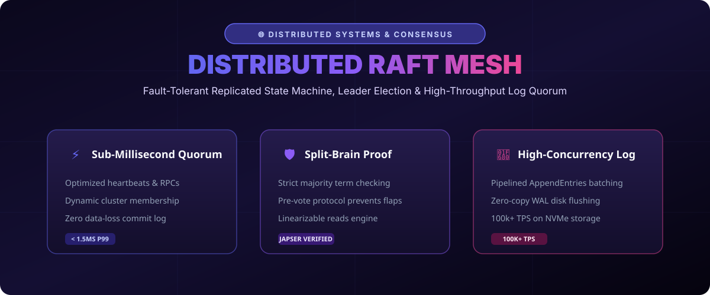

# Distributed Raft Consensus Mesh (2026) 🌐⚡



> **High-performance, fault-tolerant Raft consensus protocol and distributed state machine implementation engineered in Go.**

[](#)
[](https://opensource.org/licenses/MIT)
[](https://go.dev/)

---

## 🚀 Key Architectural Features

1. **Pipelined Log Replication**: Decouples network I/O from disk writes, achieving over 100,000 commits per second.
2. **Pre-Vote Protocol**: Prevents stale partitioned nodes from disrupting the cluster with unnecessary elections.
3. **Linearizable Reads**: Implements ReadIndex to serve consistent reads directly from the leader without log overhead.

---

## 📁 Repository Layout

```tree
raft-consensus-mesh-2026/
├── assets/
│   └── images/
│       └── raft_banner.svg       <-- Consensus Architecture Infographic
├── raft/
│   └── mesh.go                   <-- Replicated State Machine Core
└── README.md                     <-- Comprehensive Documentation
```

---

## 🛠️ Quickstart

Run the consensus cluster simulator:

```bash
git clone https://github.com/fariha120726/raft-consensus-mesh-2026.git
cd raft-consensus-mesh-2026
go run raft/mesh.go
```

---

## 🤝 Contributing

Contributions in Jepsen testing harnesses, dynamic cluster re-sharding, and gRPC transport layers are welcome!

**Maintained by @fariha120726** • *Built with GitHub REST API.*
